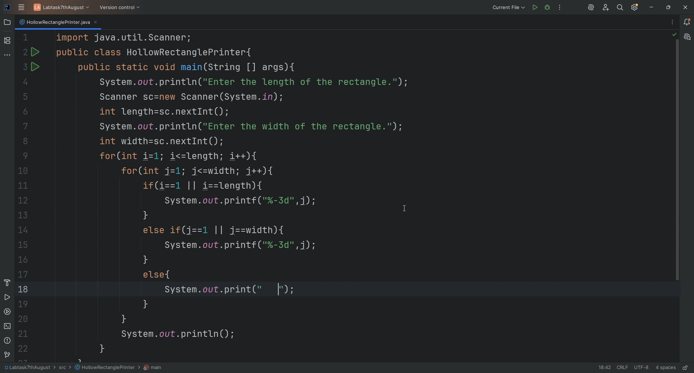

# Hollow Rectangle Printer

A simple Java console application that prints a **hollow rectangle** pattern of numbers.  
You can specify the number of rows and columns, and the program will generate the rectangle accordingly.

---

## 📜 Problem Statement

**Hint 1:** Print the character space (`' '`) in the middle.  
**Hint 2:** You can re-use your solution to a solid rectangle problem and use an `if` condition to selectively print:
- The **first and last number** of each middle row
- **All numbers** in the first and last rows

---
🎥 Demo



*This simple Java program prints a hollow rectancgle  of numbers.*


---

## 🚀 How to Run

1. **Clone this repository**  
   ```bash
   git clone https://github.com/YOUR_USERNAME/HollowRectanglePrinter.git
   cd HollowRectanglePrinter
Compile the Java file:
javac HollowRectanglePrinter.java

Run the program:
java HollowRectanglePrinter


